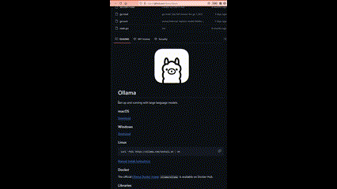

# Question Extension 

A tool for highlightling text in a Firefox browser and processing it with a Large Language Model to get analysis, explanations, or answers.



## Features

- Highlight any text in PDF documents opened in Firefox
- Process the text with an LLM with a single click
- View formatted responses with Markdown support
- Copy results to clipboard
- Cross-platform support (Firefox on Windows, macOS, Linux)

## Architecture

The project consists of two main components:

1. **Firefox Extension**: The front-end that integrates with Firefox to capture highlighted text and display results
2. **Rust Server**: A high-performance backend server that communicates with the LLM API

## Quick Start

### Running the Server

You can `docker-compose` or run the server from source:

#### Using Docker

```bash
cd server
docker-compose up -d
```

#### Building from Source

```bash
# Clone the repository
git clone https://github.com/yourusername/question-extension.git
cd question-extension/server

# Create .env file with your OpenAI API key
cp .env.example .env
# Edit .env to add your API key

# Build and run
cargo build --release
./target/release/question_extension
```

### Installing the Firefox Extension

1. [Install from Firefox Add-ons](https://addons.mozilla.org/en-US/firefox/addon/question-extension/) (recommended)

OR

2. Load temporarily for development:
   - Open Firefox and navigate to `about:debugging`
   - Click "This Firefox" in the sidebar
   - Click "Load Temporary Add-on..."
   - Select the `manifest.json` file in the `extension` directory

### Using the Tool

1. Open any PDF document in Firefox
2. Highlight text in the PDF
3. Right-click and select "Process this text with LLM"
4. View the analysis in the popup window

## Requirements

### Server Requirements
- OpenAI API key
- Internet connection
- 50MB RAM, minimal CPU usage